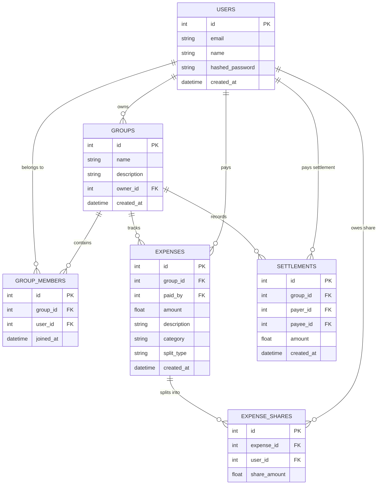

# 💎 Dolg API — Group Expense & Debt Minimization System

[](https://fastapi.tiangolo.com)
[](https://www.python.org)
[](https://www.sqlalchemy.org)
[](https://pandas.pydata.org)
[](LICENSE)

**Dolg API** is a full-stack RESTful web application and expense-sharing backend (inspired by Splitwise & Tricount). It provides seamless group expense management, flexible splitting rules (Equal & Exact), a **Greedy Debt Minimization Engine** $O(N \log N)$, category spending analytics, and a **Bilingual Web Frontend (Russian / English)** with an instant language toggle.

---

## 🌟 Key Features

1. **🔒 Secure JWT Authentication**: Password hashing using `bcrypt` and JWT token authorization.
2. **👥 Group Management**: Create expense groups, manage member access, and list user memberships.
3. **💸 Flexible Expense Splitting**:
   - **Equal Split**: Automatically distributes costs across group members.
   - **Exact Split**: Explicitly specifies exact shares per user.
4. **⚡ Greedy Debt Minimization Algorithm**:
   - Computes net balance ($\text{Paid} - \text{Owed} + \text{Settlements}$).
   - Minimizes total transactions by matching maximum debtors with maximum creditors.
5. **📊 Data Science Spending Analytics**:
   - Built with `pandas`.
   - Returns category breakdown, top spenders, and monthly financial trends (`GET /groups/{id}/analytics`).
6. **🌐 Bilingual Web Frontend Interface**:
   - Interactive Single Page Application (SPA) built with modern Dark Glassmorphic CSS.
   - Dynamic **Language Switcher (🇷🇺 RU / 🇬🇧 EN)**.

---

## 🏗 System Architecture & Database ER Diagram



---

## 🚀 Quick Start Guide

### 1. Local Setup

```powershell
# 1. Clone repository
git clone https://github.com/your-username/dolg-api.git
cd dolg-api

# 2. Create virtual environment
python -m venv .venv
.venv\Scripts\activate   # Windows (or source .venv/bin/activate on Linux/Mac)

# 3. Install dependencies
pip install -r requirements.txt

# 4. Run application
uvicorn app.main:app --reload --port 8000
```

Open your browser at:
- **Web App Interface (Bilingual RU/EN)**: `http://127.0.0.1:8000/`
- **Interactive Swagger Docs**: `http://127.0.0.1:8000/docs`

---

## 🧪 Running Automated Tests

Run the full `pytest` test suite:

```powershell
.venv\Scripts\pytest -v
```

---

## 🔌 API Endpoints Overview

| Method | Endpoint | Description | Auth Required |
| :--- | :--- | :--- | :---: |
| `POST` | `/auth/register` | Register a new user | ❌ |
| `POST` | `/auth/login` | Login & receive JWT access token | ❌ |
| `GET` | `/auth/me` | Get profile of logged-in user | ✅ |
| `POST` | `/groups` | Create a new expense group | ✅ |
| `GET` | `/groups` | List user's groups | ✅ |
| `GET` | `/groups/{id}` | Get group details & members | ✅ |
| `POST` | `/groups/{id}/members` | Add member to group by email | ✅ |
| `POST` | `/groups/{id}/expenses` | Add expense (Equal / Exact split) | ✅ |
| `GET` | `/groups/{id}/expenses` | List group expenses | ✅ |
| `GET` | `/groups/{id}/balance` | Get net balances of all members | ✅ |
| `GET` | `/groups/{id}/settle-up` | Run greedy debt minimization solver | ✅ |
| `POST` | `/groups/{id}/settlements` | Record debt payoff payment | ✅ |
| `GET` | `/groups/{id}/analytics` | Get Pandas group spending analytics | ✅ |

---

## 🐳 Docker Deployment

```powershell
# Build and run with Docker Compose
docker-compose up --build -d
```
